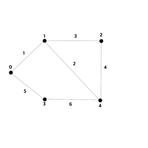

# [SwiftAlgorithm](https://github.com/pikachu987/SwiftAlgorithm "SwiftAlgorithm")

[](https://developer.apple.com/swift/)
[](https://github.com/pikachu987/SwiftAlgorithm)
[](https://github.com/pikachu987/SwiftAlgorithm/stargazers)

### 인접리스트(AdjacencyList)

무가중치 그래프


```swift
let nodeCount = 6 /// 총 노드

var array = [[Int]](repeating: [Int](), count: nodeCount)
array[0].append(1)
array[0].append(2)
array[1].append(0)
array[1].append(2)
array[1].append(3)
array[2].append(0)
array[2].append(1)
array[2].append(3)
array[2].append(4)
array[3].append(1)
array[3].append(2)
array[3].append(4)
array[3].append(5)
array[4].append(2)
array[4].append(3)
array[5].append(3)

for (index, element) in array.enumerated() {
    for item in element {
        print("정점 \(index) 에서 \(item)으로 갈수있음")
    }
}
```
```swift
정점 0 에서 1으로 갈수있음
정점 0 에서 2으로 갈수있음
정점 1 에서 0으로 갈수있음
정점 1 에서 2으로 갈수있음
정점 1 에서 3으로 갈수있음
정점 2 에서 0으로 갈수있음
정점 2 에서 1으로 갈수있음
정점 2 에서 3으로 갈수있음
정점 2 에서 4으로 갈수있음
정점 3 에서 1으로 갈수있음
정점 3 에서 2으로 갈수있음
정점 3 에서 4으로 갈수있음
정점 3 에서 5으로 갈수있음
정점 4 에서 2으로 갈수있음
정점 4 에서 3으로 갈수있음
정점 5 에서 3으로 갈수있음
```

가중치 그래프




```swift
let nodeCount = 6 /// 총 노드
var array = [[(Int, Int)]](repeating: [(Int, Int)](), count: nodeCount)
array[0].append((1, 1))
array[0].append((3, 5))
array[1].append((0, 1))
array[1].append((2, 3))
array[1].append((4, 2))
array[2].append((1, 3))
array[2].append((4, 4))
array[3].append((0, 5))
array[3].append((4, 6))
array[4].append((1, 2))
array[4].append((2, 4))
array[4].append((3, 6))

for (index, element) in array.enumerated() {
    for item in element {
        print("정점 \(index) 에서 \(item.0)으로 갈수있음 - 가중치: \(item.1)")
    }
}
```
```swift
정점 0 에서 1으로 갈수있음 - 가중치: 1
정점 0 에서 3으로 갈수있음 - 가중치: 5
정점 1 에서 0으로 갈수있음 - 가중치: 1
정점 1 에서 2으로 갈수있음 - 가중치: 3
정점 1 에서 4으로 갈수있음 - 가중치: 2
정점 2 에서 1으로 갈수있음 - 가중치: 3
정점 2 에서 4으로 갈수있음 - 가중치: 4
정점 3 에서 0으로 갈수있음 - 가중치: 5
정점 3 에서 4으로 갈수있음 - 가중치: 6
정점 4 에서 1으로 갈수있음 - 가중치: 2
정점 4 에서 2으로 갈수있음 - 가중치: 4
정점 4 에서 3으로 갈수있음 - 가중치: 6
```
