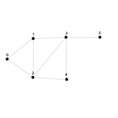

# [SwiftAlgorithm](https://github.com/pikachu987/SwiftAlgorithm "SwiftAlgorithm")

[](https://developer.apple.com/swift/)
[](https://github.com/pikachu987/SwiftAlgorithm)
[](https://github.com/pikachu987/SwiftAlgorithm/stargazers)

### 인접행렬(AdjacencyMatrix)





무가중치 그래프

```swift
let nodeCount = 6 /// 총 노드
let lineCount = 8 /// 총 간선수

var array = [[Int]].init(repeating: [Int](repeating: 0, count: nodeCount), count: nodeCount)

func changeLine(_ node1: Int, _ node2: Int) {
    array[node1][node2] = 1
    array[node2][node1] = 1 /// 무방향일때 반대도 바꿔줌
}
changeLine(0, 1) /// 0노드와 1노드가 연결
changeLine(0, 2) /// 0노드와 2노드가 연결
changeLine(1, 2) /// 1노드와 2노드가 연결
changeLine(1, 3) /// 1노드와 3노드가 연결
changeLine(2, 3) /// 2노드와 3노드가 연결
changeLine(2, 4) /// 2노드와 4노드가 연결
changeLine(3, 4) /// 3노드와 4노드가 연결
changeLine(3, 5) /// 3노드와 5노드가 연결

for i in 0..<nodeCount {
    var text = ""
    for j in 0..<nodeCount {
        text.append("\(array[i][j])")
    }
    print(text)
}
```
```swift
011000
101100
110110
011011
001100
000100
```


가중치 그래프

```swift
let nodeCount = 5
let lineCount = 6

var array = [[Int]].init(repeating: [Int](repeating: 0, count: nodeCount), count: nodeCount)

func changeLine(_ node1: Int, _ node2: Int, _ weight: Int) {
    array[node1][node2] = weight
    array[node2][node1] = weight
}
changeLine(0, 1, 1)
changeLine(0, 3, 5)
changeLine(1, 2, 3)
changeLine(1, 4, 2)
changeLine(2, 4, 4)
changeLine(3, 4, 6)

for i in 0..<nodeCount {
    var text = ""
    for j in 0..<nodeCount {
        text.append("\(array[i][j])")
    }
    print(text)
}
```
```swift
01050
10302
03004
50006
02460
```
