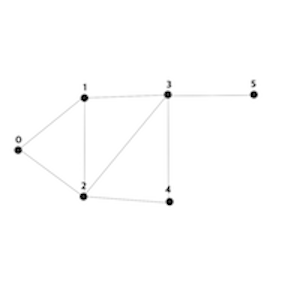

# [SwiftAlgorithm](https://github.com/pikachu987/SwiftAlgorithm "SwiftAlgorithm")

[](https://developer.apple.com/swift/)
[](https://github.com/pikachu987/SwiftAlgorithm)
[](https://github.com/pikachu987/SwiftAlgorithm/stargazers)

### 너비우선탐색(BFS)




인접 행렬에서의 너비 우선 탐색

```swift


```
```swift

```


인접 리스트에서의 너비 우선 탐색

```swift

```
```swift

```
