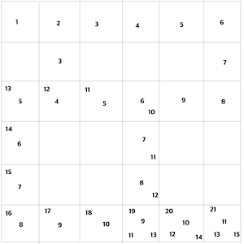

# [SwiftAlgorithm](https://github.com/pikachu987/SwiftAlgorithm "SwiftAlgorithm")

[](https://developer.apple.com/swift/)
[](https://github.com/pikachu987/SwiftAlgorithm)
[](https://github.com/pikachu987/SwiftAlgorithm/stargazers)

### 너비우선탐색 최단거리(BFS:Breadth First Search)



```swift
var array = [
[1, 1, 1, 1, 1, 1],
[0, 1, 0, 0, 0, 1],
[1, 1, 1, 1, 1, 1],
[1, 0, 0, 1, 0, 0],
[1, 0, 0, 1, 0, 0],
[1, 1, 1, 1, 1, 1]
]

let nodeCount = array.count
var cnt = 0
var xArray = [Int]()
var yArray = [Int]()
var lArray = [Int]()

func enqueue(x: Int, y: Int, l: Int) {
xArray.append(x)
yArray.append(y)
lArray.append(l)
cnt += 1
}

func bfs() {
var pos = 0
/// 시작
enqueue(x: 0, y: 0, l: 1)

/// 더 방문할곳이 없거나, 도착점이면 나감
while pos < cnt && (xArray[pos] != nodeCount-1 || yArray[pos] != nodeCount-1) {

    /// 방문함
    array[yArray[pos]][xArray[pos]] = 0

    /// 위로 갈수 있을때
    if yArray[pos] > 0 && array[yArray[pos] - 1][xArray[pos]] == 1 {
        enqueue(x: xArray[pos], y: yArray[pos] - 1, l: lArray[pos] + 1)
    }
    /// 아래
    if yArray[pos] < nodeCount - 1 && array[yArray[pos] + 1][xArray[pos]] == 1 {
        enqueue(x: xArray[pos], y: yArray[pos] + 1, l: lArray[pos] + 1)
    }
    /// 왼쪽으로
    if xArray[pos] > 0 && array[yArray[pos]][xArray[pos] - 1] == 1 {
        enqueue(x: xArray[pos] - 1, y: yArray[pos], l: lArray[pos] + 1)
    }
    /// 오른쪽으로
    if xArray[pos] < nodeCount - 1 && array[yArray[pos]][xArray[pos] + 1] == 1 {
        enqueue(x: xArray[pos] + 1, y: yArray[pos], l: lArray[pos] + 1)
    }

    pos += 1
}

if pos < cnt {
    print("최단 경로 길이: \(lArray[pos])")
}
}

bfs()
```
```swift
최단 경로 길이: 11
```
