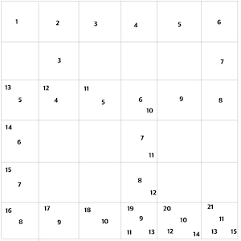

# [SwiftAlgorithm](https://github.com/pikachu987/SwiftAlgorithm "SwiftAlgorithm")

[](https://developer.apple.com/swift/)
[](https://github.com/pikachu987/SwiftAlgorithm)
[](https://github.com/pikachu987/SwiftAlgorithm/stargazers)

### 깊이우선탐색 최단거리(DFS:Depth First Search)



인접행렬

```swift
var array = [
[1, 1, 1, 1, 1, 1],
[0, 1, 0, 0, 0, 1],
[1, 1, 1, 1, 1, 1],
[1, 0, 0, 1, 0, 0],
[1, 0, 0, 1, 0, 0],
[1, 1, 1, 1, 1, 1]
]

let nodeCount = array.count
var min = nodeCount * nodeCount

func dfs(_ x: Int, y: Int, i: Int) { /// 재귀함수
if x == nodeCount - 1 && y == nodeCount - 1 {
    print("거리 = \(i)")
    if min > i {
        min = i
    }
    return
}
array[y][x] = 0
if y > 0 && array[y - 1][x] != 0 { dfs(x, y: y-1, i: i+1) }
if y < nodeCount - 1 && array[y + 1][x] != 0 { dfs(x, y: y+1, i: i+1) }
if x > 0 && array[y][x - 1] != 0 { dfs(x-1, y: y, i: i+1) }
if x < nodeCount - 1 && array[y][x + 1] != 0 { dfs(x+1, y: y, i: i+1) }

array[y][x] = 1
}

dfs(0, y: 0, i: 1)
print("최단거리 = \(min)")
```
```swift
거리 = 13
거리 = 11
거리 = 15
거리 = 21
최단거리 = 11
```
